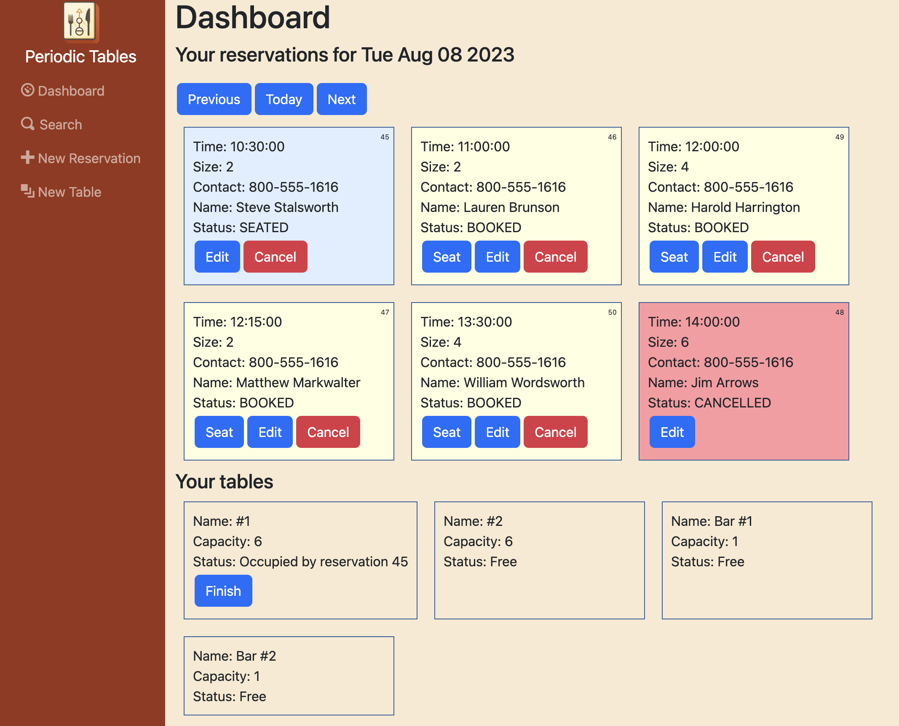
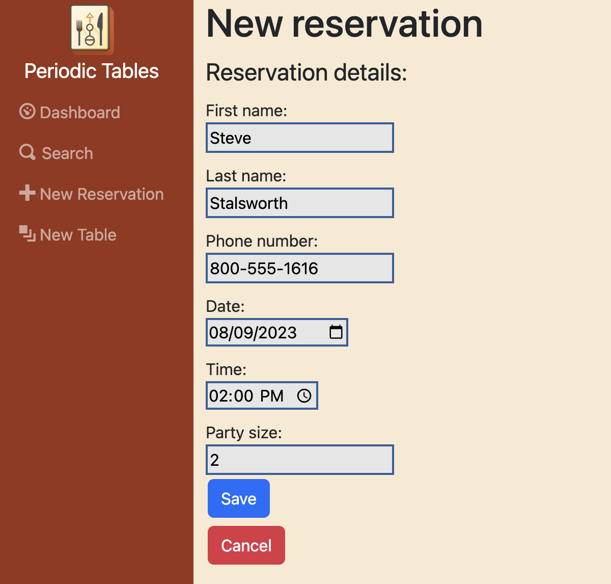
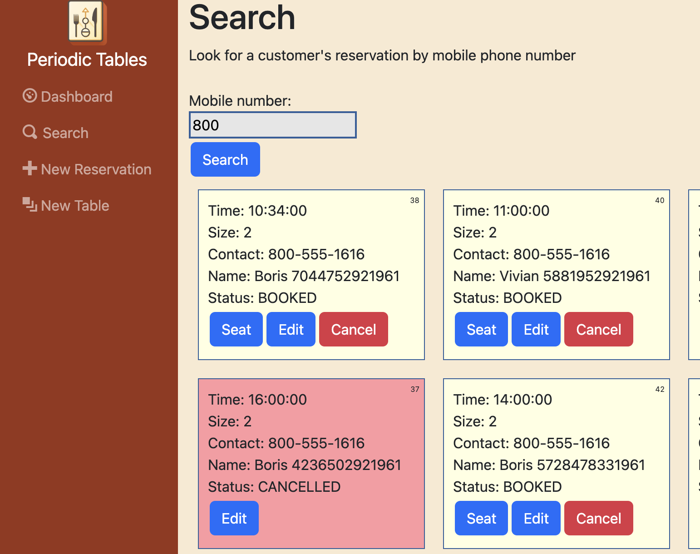

# Restaurant Reservation System

This app allows restaurant staff to manage patron reservations and seating arrangements. 

- Add, edit, update and cancel existing reservations
- Search for reservations by phone number
- Manage inventory of tables for seating
- Assign patrons to tables during their time at the restaurant

The software is intended to be used by restaurant personnel when a customer calls to request a reservation, and when patrons attend the restaurant. 

## What it does

### Reservations dashboard
View all reservations for a given date, including status of all tables/reservations.

### Make a new reservation
Restaurant staff enter details of patron reservations:
  - First and last name
  - Phone number
  - Size of party
  - Date and time 

### Edit existing reservation
Restaurant staff can edit information on existing reservation

### Create table inventory
Restaurant staff configure tables inventory to match restaurant physical layout

### Assign a reservation to a table, complete reservation
When a group arrives, restaurant staff can assign a reservation to a table while that group is dining at that table. When the group departs, reservation staff can complete the reservation and free up the table.

### Search for reservation by phone number
Restaurant staff can look up an existing 

## Technology used 
- React
- Node
- Express

Front-end app built on React. Bootstrap utilized for overall framework/structure.
Back-end service built on Node.js express server.

## Enhancements
- Dashboard 
  - Sort by time
  - Sort by party size
  - Toggle viewing 'finished' reservations
- Tables
  - Enhanced graphic interface 
  - Edit tables
- Search
  - Add Additional searchable fields
- Staff management
  - Assign servers to tables
- Multi-user management
  - Multiple users for app with login access

